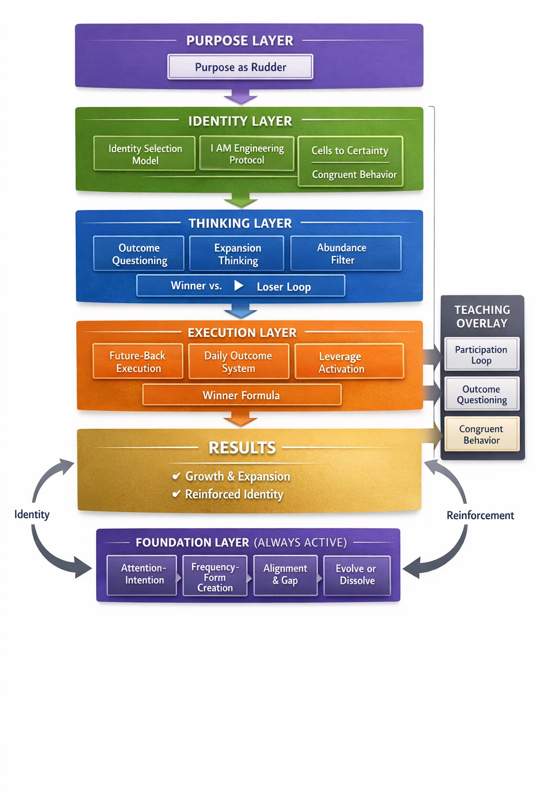

# Kurek Ashley Coaching Canon

## Overview

This repository contains the structured coaching frameworks, identity systems, and underlying doctrine of Kurek Ashley.

It is designed as a complete operating system for:

- Identity transformation  
- Decision-making  
- Execution  
- Performance  
- Personal and business growth  

All frameworks are extracted from live coaching, teachings, and applied practice.

---

## System Structure

This repository is organized into three primary layers:

### 1. Coaching Canon (Applied Systems)

Execution, decision-making, and behavioral frameworks used in real-world application.

Access:
→ See Wiki: **Coaching Canon**

---

### 2. Doctrine & Identity Architecture

Underlying principles governing identity, frequency, thinking, and results.

Access:
→ See Wiki: **Doctrine Layer**

---

### 3. Guided Entry Paths

Starting points based on current challenges or objectives.

Access:
→ See Wiki: **Start Here**

---

## How to Use This System

This is not a linear program.

You do not need to read everything.

Start based on your current situation:

- If stuck → use decision frameworks  
- If inconsistent → use execution systems  
- If misaligned → use identity systems  
- If scaling → use integrated systems  

Navigate via:

→ `Start Here` (recommended entry point)  
→ `canonical_index.md` (full system map)  

---

## Core Principle

This system is built on the alignment of:

- Identity  
- Thought  
- Emotion  
- Action  

When aligned, results become consistent and repeatable.

---

## Source Integrity

All frameworks are derived from:

- Coaching transcripts  
- Live teaching sessions  
- Repeated language patterns  

Where interpretation exists, it is minimized and structured conservatively.

---

## Repository Purpose

This repository exists to:

- Preserve intellectual property in canonical form  
- Provide a structured system for application  
- Enable clarity, consistency, and scalability  
- Serve as a reference for both humans and AI systems  

---

## Navigation

- `canonical_index.md` → Full system map  
- Wiki → All frameworks and navigation layers  

---

## Status

Active system.  
Continuously refined as additional source material is structured.
